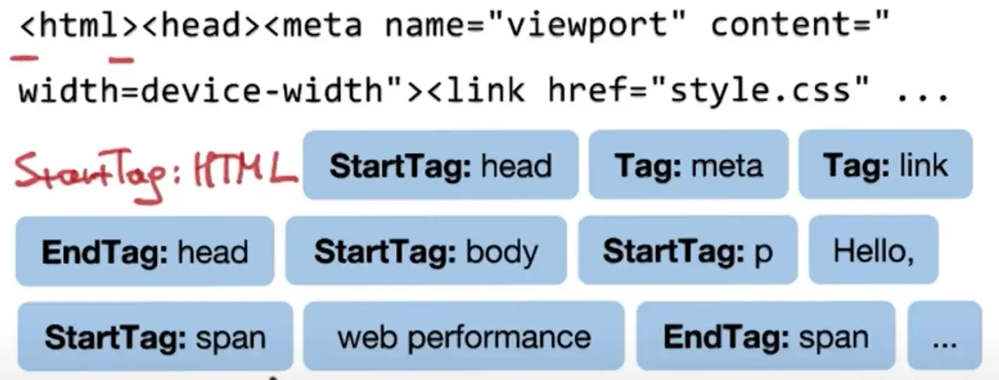

# Web Browser

Considerations:

- Detailing all activities happening inside a web browser from URL entry to paint complete.
- Identifying individual browser components
- Estimating level of difficulty to building individual browser components
- Browser completeness

# Overview

- https://joshondesign.com/2020/03/10/rust_minibrowser
- https://joshondesign.com/2020/04/15/next-steps
- https://limpet.net/mbrubeck/2014/08/08/toy-layout-engine-1.html
- https://browser.engineering/
- https://www.youtube.com/watch?v=xNu6U5XCMMQ&list=PLJbE2Yu2zumDD5vy2BuSHvFZU0a6RDmgb&index=14

|  |   |   | 
|:--:| :--:| :--:| 
| *Caption* | *Caption* | *Caption* |

Complexity of modules is represented in the amount of :computer:

## Overall Process

|  |   | 
|:--:| :--:| 
| *Generalized understanding of process (web)* | *My current understanding* |

## Example Implementation

- https://github.com/tensor-programming/rust_browser_6_final

# Elements

## Browser Engine - HTML module

The objective of this module is to output a DOM (Document Object Model) tree to be consumed by the rendering engine.

> :computer: :computer: :computer:

| Library  | Browser  |  Language  |    Stability  |
| - | - |   -  | -  |
| Flex  |   |     |     |
| Lex  |   |     |     |
| Yacc  |   |     |     |
|  Bison |   |     |     |
|  Expat |   |  Python   |     |
|   |   |     |     |

Development considerations:
- Must handle different content types based on MIME type (https://csvbase.com/blog/2)

### Creating the DOM Tree

The [DOM Tree](https://dom.spec.whatwg.org/) maintains the hierarchy of all the HTML nodes (visual and nonvisual) on the page.

```
<!DOCTYPE html>
<html>
  <head>
    <meta name="viewport" content="width=device-width,initial-scale=1" />
    <link href="style.css" rel="stylesheet" />
    <title>Critical Path</title>
  </head>
  <body>
    <p>Hello <span>web performance</span> students!</p>
    <div></div>
  </body>
</html>
```

1. The HTML module of the Browser Engine receives an input byte stream representing HTML content
3. A Lexer tokenizes the input byte stream and converts it into equivalent HTML nodes
4. A Parser arranges the HTML nodes into an Abstract Syntax Tree (DOM tree)
    - The Parser interprets all HTML nodes using rules defined in the [HTML specification](https://html.spec.whatwg.org/multipage/)[^1].




It is stated above the the HTML module contains a Lexer and a Parser, and not a Tokenizer and a Parser because a Lexer performs operations that a Tokenizer does not, namely:
- A Tokenizer breaks a stream of text into tokens, usually by looking for whitespace (angle brackets etc).
- A Lexer is basically a tokenizer, but it usually attaches extra context to the tokens -- this token is a `<body>` tag, that token is a `<div>` tag, this other token is an `` tag.

Taking this to completion:
- A Parser takes the stream of tokens from the lexer and turns it into an abstract syntax tree representing the (usually) program represented by the original text.[^2]

Implementations exist that combine the processes of Lexing and Parsing and call the module a Parser[^5] when in reality two separate operations are occuring on the input byte stream.

The DOM tree changes when:
- A piece of Javascript has triggered created, removed or modified existing HTML nodes on the page.


### Links

- https://joshondesign.com/2020/03/14/rust_browser_parser 
- https://joshondesign.com/2020/03/21/browser_long_slog
- https://limpet.net/mbrubeck/2014/08/11/toy-layout-engine-2.html
- https://github.com/lexborisov/myhtml
- https://www.youtube.com/watch?v=brhuVn91EdY
- https://github.com/tensor-programming/rust_browser_part_1
- https://blog.cloudflare.com/html-parsing-2/
- https://medium.com/geekculture/should-html-parsing-in-browsers-be-standardized-50f5012ae9f7
- https://htmlparser.info/parser/

## Browser Engine - CSS Module

> :computer: :computer:

The objective of this module is to output a CSSOM (Cascading Style Sheet Object Model) tree to be consumed by the rendering engine.

| Library  | Browser  | Language  |    Stability  |
| - | - |  -   | -  |
|   |   |     |     |

### Creating the CSSOM Tree

The [CSSOM Tree](https://www.w3.org/TR/cssom-1/) maintaings the knowledge of all styles of the DOM tree so long as a rule has been specified in external, inline or embedded CSS.

```
body {
  font-size: 16px;
}
p {
  font-weight: bold;
}
span {
  color: red;
}
p span {
  display: none;
}
img {
  float: right;
}
```

The CSSOM (CSS Object Model) tree is generated much like the DOM tree.

1. The CSS module of the Browser Engine receives an input byte stream representing CSS content from one of multiple inlets:
    - An input byte stream originating from an external CSS stylesheet, referenced by a `<link>` tag, discovered by the HTML module while constructing the DOM tree
    - An embedded stylesheet referenced inside a `<style>` tag, discovered by the HTML module while constructing the DOM tree
    - An inline style belonging to an HTML node discovered by the HTML module while constructing the DOM tree
3. A Lexer tokenizes the input byte stream, turning it into the corresponding CSS rules 
4. A Parser arranges each CSS selector into an Abstract Syntax Tree (CSSOM tree)
    - The Parser interprets all CSS selectors using rules defined in the [CSS specification](https://www.w3.org/TR/css-syntax-3/)[^1]


The CSSOM has a tree structure because the browser starts with the most general rule applicable to a specific node (for example, if it is a child of a body element, then all body styles apply) and then recursively refines the computed styles by applying more specific rules; that is, CSS rules "cascade down.


Every browser provides a default set of styles also known as "user agent styles". These styles form the initial CSSOM tree and the external, inline or embedded styles simply override these defaults.[^6]

Construction of the CSSOM tree is in the critical rendering path and this process is completed very quickly, faster than a single DNS lookup.[^6]

- https://blogs.windows.com/msedgedev/2023/01/17/the-truth-about-css-selector-performance/
- https://nolanlawson.com/2022/06/22/style-scoping-versus-shadow-dom-which-is-fastest/
- https://nolanlawson.com/2023/01/17/my-talk-on-css-runtime-performance/

### Changes in the CSSOM tree

The CSSOM tree is refreshed when:
- The dimensions of the browser viewport have changed
- The visibility of an HTML node has changed

Question: How are media queries represented in the CSSOM tree?

### Links

- https://limpet.net/mbrubeck/2014/08/13/toy-layout-engine-3-css.html
- https://limpet.net/mbrubeck/2014/08/23/toy-layout-engine-4-style.html
- https://limpet.net/mbrubeck/2014/09/08/toy-layout-engine-5-boxes.html
- https://limpet.net/mbrubeck/2014/09/17/toy-layout-engine-6-block.html
- https://www.youtube.com/watch?v=dnrEto7adg0&list=PLJbE2Yu2zumDD5vy2BuSHvFZU0a6RDmgb&index=9
- https://github.com/tensor-programming/rust_browser_part_2
- https://github.com/tensor-programming/rust_browser_part_3

## Rendering Engine

> :computer: :computer: :computer: :computer: :computer:

This module handles how to interpret the parsed HTML and creating a plan to displaying it on the screen. Man years have gone into development of different versions of this module.

> :triangular_flag_on_post: There is not a lot of community exploration and research on this subject which leads me to believe it is heavily misunderstood.

| Library  | Browser  | Language  |    Stability  |
| - | - |  -   | -  |
| Trident  | Internet Explorer  |     |     |
| Gecko  | Firefox  |     |     |
| [Webkit](https://github.com/WebKit/WebKit)  | Safari and Chrome 0-27  |     |     |
| KHTML  |  KDE desktop environment. Webkit forked from KHTML some years ago |     |     |
|  Elektra |  Opera 4-6 |     |     |
|  Presto |  Opera 7-12  |     |     |
| Blink  |  Chrome 28+, Opera 15+, webkit fork |     |     |

### Creating the Render Tree

The Render Tree maintains the knowledge of which nodes are rendered onto the page and where they are located and how they are should appear according to constraints such as screen size and user interaction.

- Combine the DOM Tree and CSSOM Tree.
  
### Additional Information

A Regular Expression Engine to pre find all required HTML, CSS, JS objects and methods and counts to pre set the rendering engine before the rendering loop begins.


  
Things like the id, tags with their widets and CSS Nested Rules need to be combined in each render loop, with some examples below:
- A set of both Horizontal and Vertical that will handle the Cells below as box Frames for div 1 sections→
- A Canvas or Frame that allows painting or drawing widgets and shapes as box Frames for div 1 to div 6 sections→
- A combo of a rectangle, a label or text widget stacked for block level elements —the cells background, spacing's and colored border
- A combo of a rectangle a label or text widget for Hyperlink Elements
- A combo of a rectangle, a button widget for button widgets with added background borders provided by the extra drawn rectangle on the canvas.
- A combo for every other widget the same such as entry, text entry, combo box, scroll box, radio buttons, check boxes, dividers for hr tags etc.

All of this above requires massive libraries in pairs for either CSS float or display to handle Horizontal and Vertical and to store all their tag or id names by counts and sections to allow JS to do after render methods.

The cell allows margins and borders between the rectangle object and the label or widget objects.

Margins and padding are easily added into the widgets as integers using math and by their own names which some may require minor Tokenizing from the CSS Tokenizer earlier: Regular Expressions do not like background-color or text-width where they are confused bgy width and color after a delimiter “-color”or”-width” so minor tokenizing is required for such.

```
width=parent_width+margin_left # The Frame Notice the Regular Expression Tokenized “-” to ”_” in margin_left
width=parent_width+padding_left etc. # The Cell
```


A Pic of Chrome beside Tk testing HTML Cell Rendering to adjust border and spacing properties.

It does require math within the Cell Methods also. 

CSS can be transferred without allot of Tokenizing simply by assigning the CSS value directly to the widgets value variables. Such as background=background-color etc. CSS is render-blocking. That means the browser blocks page rendering until receive and process all CSS of the page. The reason why it happens is that CSS overrides it, so if you, for example, will allow partial rendering, with partial CSS, you will end up with an inconsistent state of the view until finish to process all CSS of the page.

Width and height have to be carried and returned for each new widtget combo in the stack also.

Nothing will fully match between Webkit, Firefox and Edge spacing because of NCSA Mosaic Widgets and they also do not fully match in many ways because of differences between Spyglass and Netscape Navigator’s having a different CSS Engine while both were developed by both Sun Micro Systems and Microsoft to render CSS differently.

### Links

- https://joshondesign.com/2020/03/24/type_madness
- https://joshondesign.com/2020/04/08/rust5_tree
- https://joshondesign.com/2020/04/11/rust_layout
- https://joshondesign.com/2020/04/13/browser_render
- https://limpet.net/mbrubeck/2014/11/05/toy-layout-engine-7-painting.html
- https://www.youtube.com/watch?v=8e37RsyiGSE&list=PLJbE2Yu2zumDD5vy2BuSHvFZU0a6RDmgb&index=11
- https://www.youtube.com/watch?v=GuzZqrlc52s&list=PLJbE2Yu2zumDD5vy2BuSHvFZU0a6RDmgb&index=12
- https://www.youtube.com/watch?v=rszgtm7i0n8&list=PLJbE2Yu2zumDD5vy2BuSHvFZU0a6RDmgb&index=13
- https://github.com/tensor-programming/rust_browser_part_3
- https://github.com/tensor-programming/rust_browser_part_4
- https://github.com/tensor-programming/rust_browser_part_5

## Javascript Engine

> :computer: :computer: :computer: :computer: :computer:
  
| Library  | Browser  | Language  |    Stability  |
| - | - |  -   | -  |
| SpiderMonkey  | Gecko/Firefox  |     |     |
| TraceMonkey  |  SpiderMonkey in Firefox 3.1 and introduces JIT (just-in-time) compilation |     |     |
| KJS  | Konqueror, tied to KHTML  |     |     |
|  JScript | Trident, Internet Explorer  |     |     |
| JavascriptCore  | Webkit by the Safari browser  |     |     |
| SquirrelFish  |  Webkit and adds JIT like TraceMonkey |     |     |
| V8  | Google's Javascript engine used in Chrome and Opera  |     |     |
| [Chakra](https://github.com/chakra-core/ChakraCore) |    |   |   |   |  
|   |   |     |     |

A Javascript engine consists of a Lexer and a Parser.

This module is entirely separate from the Browser Engine.

Several of these tend to be tied to a particular rendering engine.

- https://web.archive.org/web/20230113174326im_/https://egbert.net/images/timeline-js-jit-engines.svg

## GUI Toolkit

This is the module that draws the elements created by the rendering engine to the screen .

| Library  | Browser  | Language  |    Stability  |
| - | - |  -   | -  |
| wxWidgets  |   |     |     |
| Qt  |   |     |     |
| Tcl/Tk  |   |     |     |
| GTK  |   |     |     |
|   |   |     |     |

## User Interface

This module handles displaying the UI for operations such as:
- Navigation between pages
- Page history
- Clearing temporary files
- Typing in a URL
- Autocompleting URLs

| Library  | Browser  | Language  |    Stability  |
| - | - |   -  | -  |
| skia  | chrome  |     |     |
|   |   |     |
  
## Networking

> :computer: :computer: 

This module handles all of complexity / subtlety of the HTTP protocol eg data transfer, expires headers, different versions, TLS etc.
  
| Library  | Browser  | Language  |    Stability  |
| - | - |  -   | -  |
| Necko  | Firefox  |     |     |
|   |   |     |     |

Url Request Methods
Url Multi IO Threaded Request Methods for CSS, Images, Media and JS files, these have to be live to be fast and efficient.

Development considerations:
- How many concurrent connections to use?
- Error reporting to the user
- Proxies
- User options

- https://github.com/alex/what-happens-when
- https://aws.amazon.com/blogs/mobile/what-happens-when-you-type-a-url-into-your-browser/
- https://sheep.horse/2017/10/how_you_are_reading_this_page.html

## Database

Stores things relevant to the browser such as:

- Cookies
- Cache
- Security Certificates
- Bookmarks

## On Analyzing Browser Builds

It's necessary to determine a baseline test for all browsers to consume and assess how close each come to rendering controlled layouts, and it's nice to know where the stopping point is.[^4]
  
- https://edwardtufte.github.io/tufte-css/
  
Assessment will focus on:
  
- Visual accuracy
- Time

## Web Browser Projects
  
**Tensor Programming - Rust Browser**
> :white_check_mark: Custom Design
- [Part 1 - Dom and HTML Parser](https://github.com/tensor-programming/rust_browser_part_1)
- [Part 2 - CSS Engine and CSS Parser](https://github.com/tensor-programming/rust_browser_part_2)
- [Part 3 - Style Tree](https://github.com/tensor-programming/rust_browser_part_3)
- [Part 4 - Layout Tree](https://github.com/tensor-programming/rust_browser_part_4)
- [Part 5 - Command Module and Rendering Engine](https://github.com/tensor-programming/rust_browser_part_5)
- [Part 6 - Completing Browser Engine](https://github.com/tensor-programming/rust_browser_6_final)
  
**Josh on Design - Rust Browser**
> :white_check_mark: Custom Design
- [GitHub](https://github.com/joshmarinacci/rust-minibrowser)
- [Part 1 - Building a Web Browser](https://joshondesign.com/2020/03/10/rust_minibrowser)
- [Part 2 - Parsers](https://joshondesign.com/2020/03/14/rust_browser_parser)
- [Part 3 - A Long Slog for Small Features](https://joshondesign.com/2020/03/21/browser_long_slog)
- [Part 4 - Type Madness](https://joshondesign.com/2020/03/24/type_madness)
- [Part 5 - A Proper Tree Structure](https://joshondesign.com/2020/04/08/rust5_tree)
- [Part 6 - Layout](https://joshondesign.com/2020/04/11/rust_layout)
- [Part 7 - Rendering](https://joshondesign.com/2020/04/13/browser_render)
- [Part 8 - Next Steps](https://joshondesign.com/2020/04/15/next-steps)
    
**A Toy Rendering Engine**
> :white_check_mark: Custom Design
- [GitHub](https://github.com/mbrubeck/robinson)
- [Part 1 - Getting Started](https://limpet.net/mbrubeck/2014/08/08/toy-layout-engine-1.html)
- [Part 2 - HTML](https://limpet.net/mbrubeck/2014/08/11/toy-layout-engine-2.html)
- [Part 3 - CSS](https://limpet.net/mbrubeck/2014/08/13/toy-layout-engine-3-css.html)
- [Part 4 - Style](https://limpet.net/mbrubeck/2014/08/23/toy-layout-engine-4-style.html)
- [Part 5 - Boxes](https://limpet.net/mbrubeck/2014/09/08/toy-layout-engine-5-boxes.html)
- [Part 6 - Block Layout](https://limpet.net/mbrubeck/2014/09/17/toy-layout-engine-6-block.html)
- [Part 7 - Painting 101](https://limpet.net/mbrubeck/2014/11/05/toy-layout-engine-7-painting.html)
  
**EinkBro**
- [GitHub](https://github.com/plateaukao/einkbro)
  
**Kosmonaut**
- [GitHub](https://github.com/twilco/kosmonaut)
  
**Polypane**
> :x: Uses Electron WebView; Not a true browser implementation
- [How I built my own browser](https://kilianvalkhof.com/2020/design/how-i-built-my-own-browser/)
- [Interview with Creator of Polypane, a Powerful Browser for Developers](https://www.infoq.com/articles/polypane-developer-browser-interview/)
    - [On Hacker News](https://news.ycombinator.com/item?id=19553941)

**Metastream**
- [GitHub](https://github.com/samuelmaddock/metastream)
- [Website](https://getmetastream.com/)
- [I tried creating a web browser, and Google blocked me](https://blog.samuelmaddock.com/posts/google-widevine-blocked-my-browser/)

**Lexbor**
> :white_check_mark: Custom Design
- https://lexbor.com/articles/html/

**Browser From Scratch - Viethung**
> :white_check_mark: Custom Design
- [Browser from Scratch: Introduction](https://viethung.space/blog/2020/05/29/Browser-from-Scratch-Introduction/)
- [Browser from Scratch: DOM API](https://viethung.space/blog/2020/09/01/Browser-from-Scratch-DOM-API/)
- [Browser from Scratch: HTML parsing](https://viethung.space/blog/2020/10/24/Browser-from-Scratch-HTML-parsing/)
- [Browser from Scratch: CSS parsing & processing](https://viethung.space/blog/2021/01/13/Browser-from-Scratch-CSS-parsing-processing/)
- [Browser from Scratch: Layout](https://viethung.space/blog/2021/09/26/Browser-from-Scratch-Layout/)

## Open Source Web Browsers

- https://librewolf.net/
- https://www.waterfox.net/
- https://arc.net/
- https://www.brow.sh/
  - https://news.ycombinator.com/item?id=17487552
- https://servo.org/
  - https://github.com/rockxcn/book-1/blob/master/Develop%20the%20Servo%20Web%20Browser%20Engine%20using%20Rust.pdf
- https://awesomekling.github.io/Ladybird-a-new-cross-platform-browser-project/
- https://news.ycombinator.com/item?id=32809126
- https://news.ycombinator.com/item?id=24170201

## How Web Browsers Work

- https://developer.chrome.com/blog/inside-browser-part1/
- https://hacks.mozilla.org/2017/10/the-whole-web-at-maximum-fps-how-webrender-gets-rid-of-jank/
- https://www.peteresnyder.com/static/papers/speedreader-www-2019.pdf
- https://hacks.mozilla.org/2020/04/code-quality-tools-at-mozilla/
- https://stackoverflow.com/questions/598841/how-to-get-started-building-a-web-browser
- https://mhassan-work99.medium.com/understanding-dom-cssom-render-tree-795399cad299
- https://medium.com/weekly-webtips/understand-dom-cssom-render-tree-layout-and-painting-9f002f43d1aa
- https://stackoverflow.com/questions/380455/looking-for-a-clear-definition-of-what-a-tokenizer-parser-and-lexers-are
- https://web.dev/critical-rendering-path-render-tree-construction/

## Libraries related to Web Browsers

- https://github.com/cixtor/readability
- https://kas-gui.github.io/blog/state-of-GUI-2022.html

## Miscellaneous (I need to sort)

- https://eylenburg.github.io/browser_engines.htm
- https://eylenburg.github.io/browser_comparison.htm
- https://news.ycombinator.com/item?id=34369560
- https://lexborisov.github.io/myhtml/
- https://www.cocoanetics.com/2011/09/taming-html-parsing-with-libxml-1/

## Ad Block for Web Browsers

This is the main source of motivation - to learn how to undesired content is blocked from view and prevented from running.

- https://github.com/brave/adblock-rust
- https://www.cs.ucr.edu/~zhiyunq/pub/pets17_anti_adblocker.pdf
- https://levelup.gitconnected.com/building-your-own-adblocker-in-literally-10-minutes-1eec093b04cd
- https://medium.com/@KentGruber/build-your-own-ad-blocker-90230436e364
- https://hackernoon.com/your-own-ad-blocker-in-3-minutes-bpo42wz
- https://adrianstoll.com/post/create-your-own-adblocker-an-introduction-to-writing-chrome-extensions/
- http://diposit.ub.edu/dspace/bitstream/2445/119257/2/memoria.pdf
- https://www.zdnet.com/article/ublock-origin-gets-option-to-block-all-javascript-execution-by-default/
- https://www.kevel.com/blog/how-ad-blockers-work

[^1]: [Understanding DOM, CSSOM, Render Tree, Layout, and Painting](https://medium.com/weekly-webtips/understand-dom-cssom-render-tree-layout-and-painting-9f002f43d1aa)
[^2]: [Looking for a clear definition of what a "tokenizer", "parser" and "lexers" are and how they are related to each other and used?](https://stackoverflow.com/questions/380455/looking-for-a-clear-definition-of-what-a-tokenizer-parser-and-lexers-are)
[^3]: [Render-tree Construction, Layout, and Paint](https://web.dev/critical-rendering-path-render-tree-construction/)
[^4]: [Josh on Design: Building a Rust Web Browser](https://joshondesign.com/2020/03/10/rust_minibrowser)
[^5]: [Constructing a Document Tree](https://browser.engineering/html.html)
[^6]: [How Browsers Work - Building the CSSOM](https://developer.mozilla.org/en-US/docs/Web/Performance/How_browsers_work#building_the_cssom)
